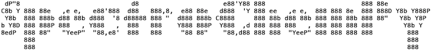

## What is SpectroChemPy?

SpectroChemPy (SCPy) is a framework for processing, analyzing and modeling 
Spectroscopic data for Chemistry with Python. It is a cross platform software, 
running on Linux, Windows or OS X.

||| 
|---:|:---|
|**Tests**| [](https://github.com/spectrochempy/spectrochempy/actions) [](https://lgtm.com/projects/g/spectrochempy/spectrochempy/alerts/) [](https://lgtm.com/projects/g/spectrochempy/spectrochempy/context:python) [](https://codeclimate.com/github/spectrochempy/spectrochempy/maintainability) [](https://codeclimate.com/github/spectrochempy/spectrochempy/test_coverage)|
|**Packages**|  [](https://badge.fury.io/py/spectrochempy)||
|**Docs**|[](https://www.spectrochempy.fr/latest) [](https://doi.org/10.5281/zenodo.3823841) |

## Features

Among its major features:

* A NDDataset object embedding array of data with labeled axes and metadata.
* A Project manager to work on multiple NDDataset simultaneously.
* Physical Units for NDDataset.
* Mathematical operations over NDDataset such addition, multiplication and many more ...
* Import functions to read data from experiments or modeling programs ...
* Display functions such as plot for 1D or nD datasets ...
* Export functions to csv, xls formats ...
* Preprocessing functions such as baseline correction, automatic subtraction and many more ...
* Fitting capabilities for single or multiple datasets ...
* Exploratory analysis such as SVD, PCA, MCR_ALS, EFA ...

**Warning**:

     SpectroChemPy is still experimental and under active development. 
     Its current design is subject to major changes, reorganizations, bugs and crashes!!!. 
     Please report any issues to the Issue Tracker.

## Documentation

The online Html documentation is available here:  [HTML documentation](https://www.spectrochempy.fr)

### Examples, tutorials

A zip archive of all the notebooks corresponding to the documentation  can be found [here](https://www.spectrochempy.fr/downloads/stable-spectrochempy-notebooks.zip)

## Installation

Follow the instructions here: [Installation guide](https://www.spectrochempy.fr/stable/gettingstarted/install/index.html)

## Issue Tracker

You find a problem, want to suggest enhancements or want to look at the current issues and milestones, you can go there:  [Issue Tracker](https://github.com/spectrochempy/spectrochempy/issues)

## Citing SpectroChemPy

When using SpectroChemPy for your own work, you are kindly requested to cite it this way:
```
Arnaud Travert & Christian Fernandez, (2020) SpectroChemPy (Version 0.2). Zenodo. http://doi.org/10.5281/zenodo.3823841
```

## Source repository 

The source are versioned using the git system and hosted on the GitHub platform: 
https://github.com/spectrochempy/spectrochempy

## License

[CeCILL-B FREE SOFTWARE LICENSE AGREEMENT](https://cecill.info/licences/Licence_CeCILL-B_V1-en.html)
