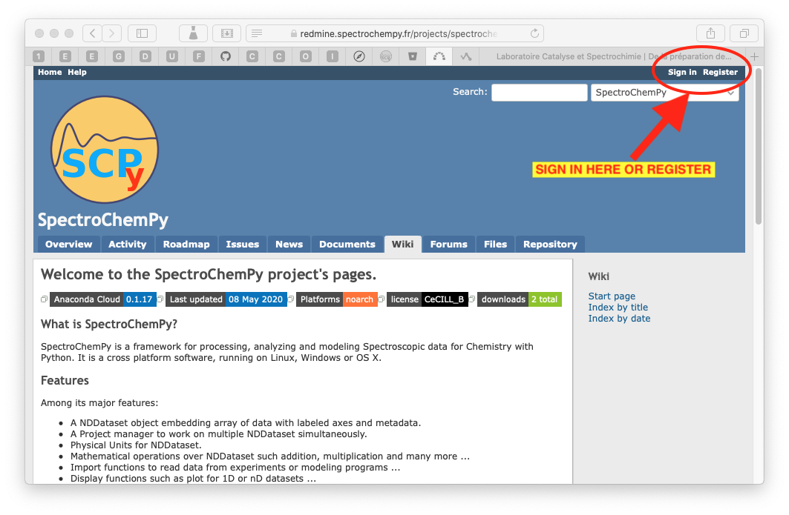

.. _develguide:

How can I contribute  to |scpy|?
===================================

Every |scpy| user can make a useful contribution.

There are several ways to do this, depending on your programming knowledge:

* report bugs
* request for improvement or new features
* contribute to the documentation
* writing tutorials
* pull request to the |scpy| repository.
* ...

It is worth noting that in order to post on the
`project website (redmine.spectrochempy.fr) <https://redmine.spectrochempy.fr>`_ , it is better to be registered,
as without registration as a member your interaction with the project may be very limited.

**Table of Contents**

.. toctree::
    :maxdepth: 3

    issues
    forums
    code
    testing
    docs
    pypi
    conda
    docker

