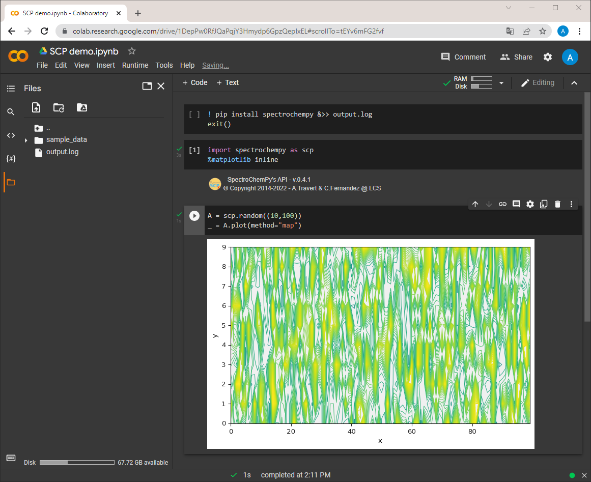
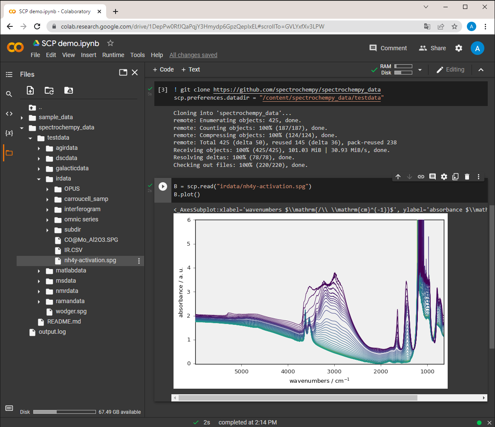

.. _install_colab:

****************************************
Install in Google Colaboratory (Colab)
****************************************

Maybe you want to try or run SpectroChemPy without installing python and all the
necessary packages on your computer.

To do this you can use
`Colaboratory <https://colab.research.google.com/notebooks/intro.ipynb?hl=en#>`__,
in short `Colab`, which allows you to run python notebooks in your browser without any
installation.

The Colab Notebooks are very similar to Jupyter Notebook (from which they derive).

To start with Colab, go to the
`Colab website <https://colab.research.google.com/notebooks/intro.ipynb#recent=true>`__
and create a new notebook.

Load and install SpectroChemPy with pip
---------------------------------------

In the first cell, enter and execute the following block of instructions to load and
install SpectroChemPy in Colab.

.. sourcecode:: ipython3

    ! pip install spectrochempy &>> output.log
    exit()

.. note::

  The whole process takes 1-2 minutes. The `exit()` instruction allows restarting
  runtime automatically: do not pay
  attention to the popup messages about session crash/restart. You can safely close them.

Then as usual in Jupyter Notebook you can start using SpectroChemPy by inserting
adding new code cells:

.. warning::

   Colab notebooks are isolated and thus you need to perform the above operation
   for all notebook you create... and to run it each time you reopen the notebook
   for further processing or analysis.

Load data files
---------------
As Colab notebooks are hosted on Google servers, they have no direct access to your
local drive (unlike a Jupyter notebook for instance).
There are several ways to load datafiles on the server:

* Through the file-explorer pane located on the left-hand side of the Colab window
  (NOT the File menu which is devoted to notebooks and scripts management !),

* Equivalently by importing the `files` module from the `google.colab` library and
  runing the `files.upload()` widget (works best on Google Chrome).

.. sourcecode:: ipython3

    from google.colab import files
    files.upload()

* By connecting the notebook to your Google Drive (this of course requires that your
  local files are synchronized with Google drive), using the file-explorer pane.

* By cloning a GitHub repository using `git clone`.

For the exercise/tutorials with SpectroChemPy, note that some data are available in the
`Github directory (spectrochempy_data/testdata) <https://github.com/spectrochempy/spectrochempy_data/tree/master/testdata>`__.
You don't need to download them because if they are not yet found in the default data
directory when you use them, they will be downloaded automatically and saved
(so they will not be downloaded next time you need it)
