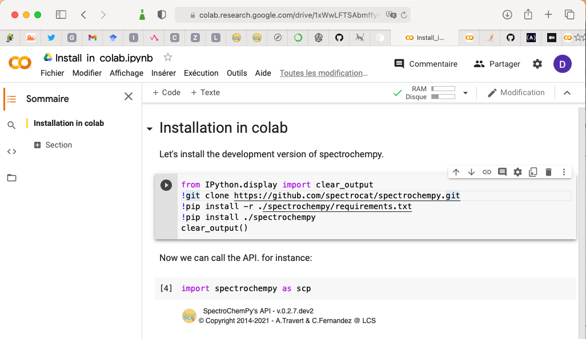

.. _install_colab:

****************************************
Install in Google Colaboratory (Colab)
****************************************

May be you want to try or run SpectroChemPy without installing python and all the necessary packages on your computer.

To do this you can use `Colaboratory <https://colab.research.google.com/notebooks/intro.ipynb?hl=en#>`__,
in short `Colab`, which allows you to run python notebooks in your browser without any installation.

The Colab Notebooks are very similar to Jupyter Notebook (from which they derive).

To start with Colab, go to the `Colab website <https://colab.research.google.com/notebooks/intro.ipynb#recent=true>`_
and create a new notebook.

In the a cell, you enter and execute the following block of instructions to load SpectroChemPy and the
tests/examples files in Colab.

.. sourcecode:: ipython3

    !wget -c "https://www.spectrochempy.fr/downloads/set_colab.sh" &> /dev/null
    !bash set_colab.sh
    exit()

.. note::

  Do not pay attention to the message about killed kernel.
  It is restarted automatically!
  You can safely close the popup messages.

Then as usual you can start using SpectroChemPy.

.. warning::

   Colab notebooks are isolated and thus you need to perform the above operation for all notebook you create.

Example of a Colab session
--------------------------

.. raw:: html

   <video width="696" controls>
   <source src="../../_static/video/capsule_colab.mp4" type="video/mp4">
   Your browser does not support the video tag.
   </video>
