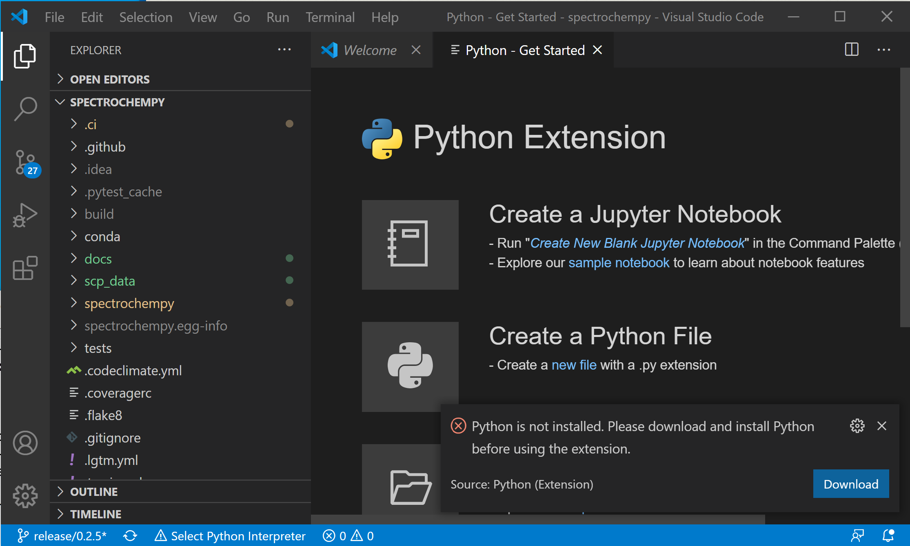

:orphan:

Editors
========

Visual Studio Installation
---------------------------
Download `Visual Studio Code <https://code.visualstudio.com/>`__
and install it.

Configuration
--------------
.. image:: images/vscode.png

Click on ``Customize > Tools and languages > python``  to install support to python.

Source control
---------------
If you have already already cloned the scpy repository, you can open the corresponding folder.
Click on the Source control icons on the left bar and then open folder.
If your repository is not yet cloned you can also do it from here (use ``Clone Repository`` button).
If ``git`` is not yet installed you can also do it from here (``install git`` )
Once git is installed you need to restart VSCode.

Start editing
-------------
once you have selected the spectrochempy folder you should get something like this,
where you have access to all components of the project.

