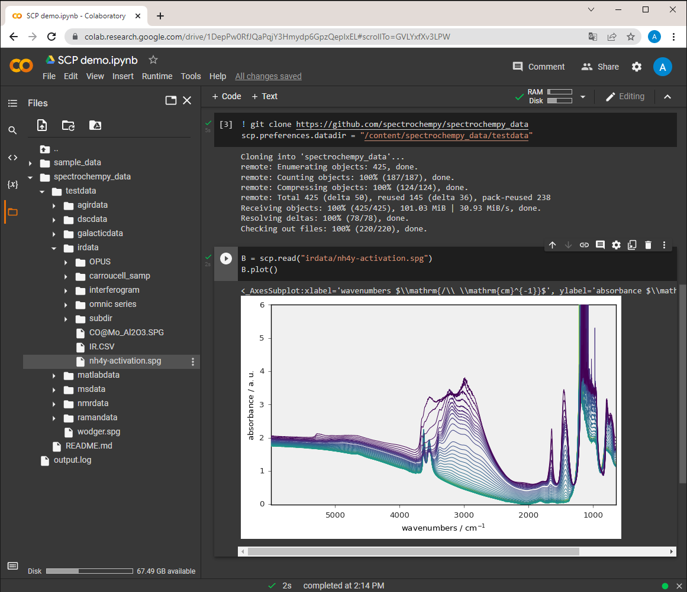

.. _install_colab:

**************************************
Install in Google Colaboratory (Colab)
**************************************

.. contents:: Table of Contents
   :local:
   :depth: 2

Introduction
------------

If you want to try or run SpectroChemPy without installing python and all the
necessary packages on your computer, an excellent solution is to use a cloud-based
service that allows you to run python notebooks in your browser without any installation.

To do this you can use
`Colaboratory <https://colab.research.google.com/notebooks/intro.ipynb?hl=en#>`__,
in short `Colab`. Colab is a free Jupyter notebook environment provided by Google.

Quick Start
-----------

To start with Colab, go to the
`Colab website <https://colab.research.google.com/notebooks/intro.ipynb#recent=true>`__
and create a new notebook.

For learning purpose you can also simply execute the
`example notebook on Colab <https://colab.research.google.com/github/spectrochempy/spectrochempy_tutorials/blob/main/colab/0_install_spectrochempy_on_colaboratory_tutorial.ipynb>`__  |Open in Colab|

.. |Open in Colab| image:: https://colab.research.google.com/assets/colab-badge.svg
   :target: https://colab.research.google.com/github/spectrochempy/spectrochempy_tutorials/blob/main/colab/0_install_spectrochempy_on_colaboratory_tutorial.ipynb

Installation
------------

On a new Colab notebook, you can install SpectroChemPy by running the following commands in a code cell:

.. tabs::

    .. tab:: Stable Version

        .. sourcecode:: ipython3

            !pip install spectrochempy &>> install.log

    .. tab:: Development Version

        .. sourcecode:: ipython3

            !git clone --depth=1 https://github.com/spectrochempy/spectrochempy.git &>> install.log
            !pip install ./spectrochempy &>> install.log
            !rm -rf spectrochempy

.. warning::

    Colab notebooks are isolated - installation must be repeated for each new notebook session.

Working with Data
-----------------

Directly loading Example Files
^^^^^^^^^^^^^^^^^^^^^^^^^^^^^^

.. sourcecode:: ipython3

    import spectrochempy as scp
    dataset = scp.read('irdata/nh4y-activation.spg')

Using File Explorer
^^^^^^^^^^^^^^^^^^^

Through the file-explorer pane located on the left-hand side of the Colab window
(NOT the File menu which is devoted to notebooks and scripts management !).

Equivalently by importing the files module from the
`google.colab`` library and running the `files.upload()` widget (works best on Google Chrome).

.. sourcecode:: ipython3

    from google.colab import files
    files.upload()

Using Google Drive
^^^^^^^^^^^^^^^^^^

By connecting the notebook to your Google Drive (this of course requires that your
local files are synchronized with Google drive), using the file-explorer pane.

.. sourcecode:: ipython3

    from google.colab import drive
    drive.mount('/content/drive')

Using Git Repository
^^^^^^^^^^^^^^^^^^^^

By cloning a git repository using `git clone` .

.. sourcecode:: ipython3

    !git clone https://example.com/path/to/my-project.git
    scp.preferences.datadir = "/content/my-project"

.. note::

    Colab has no direct access to your local drive. Choose the most appropriate method
    above for your data access needs.

Then as usual in Jupyter Notebook you can start using SpectroChemPy by inserting
adding new code cells:

.. image:: images/colab_1.png
       :alt: Colab windows

