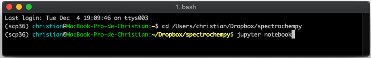
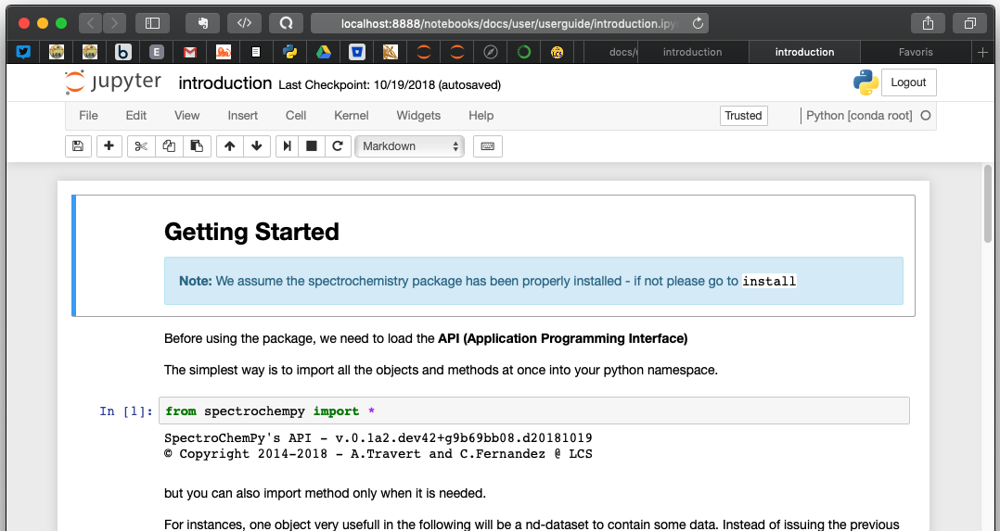

.. _userguide:

User Guide
==========

The |scpy| **API** is accessible in a terminal using a python or
an IPython shell.

However, the recommended way is to use a Jupyter notebook.

Assuming Jupyter is installed (if not install it!), go to the
|scpy| folder. From this location, open a
terminal and type:

Your default explorer is now launched.

.. image:: images/jupyter_home.png

You can now navigate to the userguide notebooks in  `docs/user/userguide`.

Click on the the fist notebook : **introduction.ipynb**

This notebook and others are used to produce this user guide.
So this way you can follow the explanations given below.

1.Introduction
---------------

.. toctree::
   :maxdepth: 1

   1.1_introduction

2.The NDDataset object
-----------------------

.. toctree::
   :maxdepth: 1

   2.1_nddataset
   2.2_plotting
   2.3_baseline_correction

3.Import & export of NDDatasets
--------------------------------
.. toctree::
   :maxdepth: 1

   3.1_importing

4.Units and uncertainty
------------------------

.. toctree::
   :maxdepth: 1

   4.1_units_and_uncertainties

5.Databases
-------------

.. toctree::
   :maxdepth: 1

   5.1_isotope_database

6.NMR
-------

.. toctree::
   :maxdepth: 1

   6.1_nmr_intro
