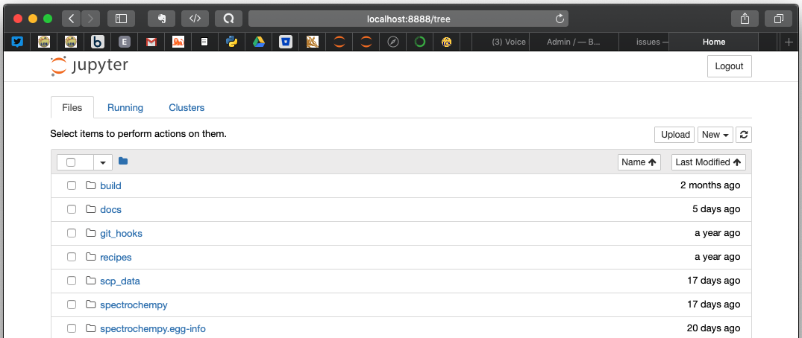

.. _userguide:

User Guide
==========

The |scpy| **API** is accessible in a terminal using a python or
an IPython shell.

However, the recommended way is to use a Jupyter notebook.

Assuming Jupyter is installed (if not install it!), go to the
|scpy| folder. From this location, open a
terminal and type:

.. image:: launch_jupyter.png

Your default explorer is now launched.

You can now navigate to the userguide notebooks in docs/user/userguide.
click on the the fist notebook : **introduction.ipynb**

.. image:: jupyter_intro.png

This notebook and others are used to produce this user guide.
So this way you can follow the explanations given below.

Introduction
------------

.. toctree::
    :maxdepth: 1

    introduction

The NDDataset object
---------------------

.. toctree::
	:maxdepth: 1

	nddataset
	plotting
	baseline_correction

Units and uncertainty
----------------------

.. toctree::
	:maxdepth: 1

	units_and_uncertainties

Databases
----------

.. toctree::
	:maxdepth: 1

	isotope_database

NMR
----

.. toctree::
	:maxdepth: 1

	nmr_intro
