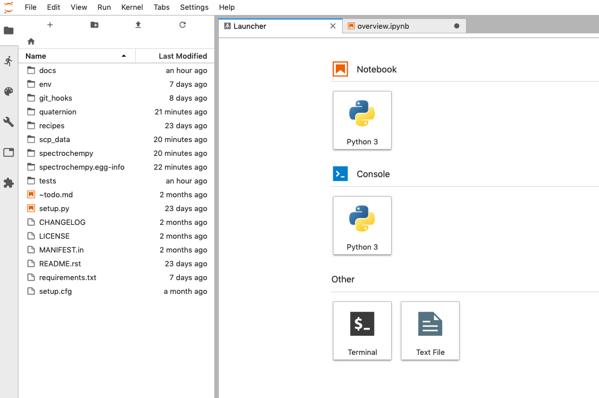

.. _how_to_get_started:

Working with Jupyter notebooks
===============================

Currently **SpectroChemPy** can be used as a library for python scripts.

For ease of use, we recommend using the
`JupyterLab <https://jupyterlab.readthedocs.io/en/stable/getting_started/overview.html>`__
application or for those who are more comfortable with programming,
writing python scripts in a development environment such as
`PyCharm <https://www.jetbrains.com/fr-fr/pycharm/>`__, `VS
Code <https://code.visualstudio.com>`__ or
`Spyder <https://www.spyder-ide.org>`__.

To launch `Jupyter Lab`, open a terminal and issue the following commands:

Go to your favorite user document folder (*e.g.,* \`$HOME/workspace/) or
any other folder you want to use to store your work).

.. code:: bash

   $ cd ~/workspace
   $ jupyter lab

Your default browser should now be open, and the window should look like
this:

From there, it is quite easy to create notebooks or to navigate to
already existing ones.

Using the application in a web browser
======================================

.. Note::

   **In progress**

   For the moment we don’t yet have a graphical interface to offer other
   than Jupyter notebooks or python scripts. It is in any case our
   preferred way of working with SpectroChemPy because it offers all the
   necessary flexibility for a fast and above all reproducible realization
   of the different tasks to be performed on spectroscopic data.

   However we have started to create a simple interface using Dash which
   will allow in a future version to work perhaps more simply for those who
   do not have the time or the will to learn to master the rudiments of
   python or who do not wish to program.
